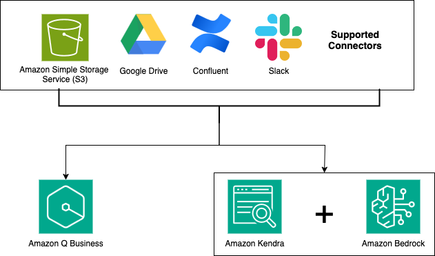

# AWS Sample GenAI Connector Patterns

This repo contains patterns showing how to build RAG based applications using infrastructure-as-code (IaC). It provides 2 base architectures 

- [Amazon Bedrock](https://aws.amazon.com/bedrock/) + [Amazon Kendra](https://aws.amazon.com/kendra/) integration SAM and CDK templates for supported Kendra connectors
- [Amazon Q Business](https://aws.amazon.com/kendra/) SAM and CDK templates for Q Business supported connectors.
- To learn more about submitting a pattern, read the [publishing guidelines page](https://github.com/aws-samples/sample-genai-connector-patterns/blob/main/PUBLISHING.md).



**Disclaimer:** Sample code, software libraries, command line tools, proofs of concept, templates, or other related technology are provided as AWS Content or Third-Party Content under the AWS Customer Agreement, or the relevant written agreement between you and AWS (whichever applies). You should not use this AWS Content or Third-Party Content in your production accounts, or on production or other critical data. You are responsible for testing, securing, and optimizing the AWS Content or Third-Party Content, such as sample code, as appropriate for production grade use based on your specific quality control practices and standards. Deploying AWS Content or Third-Party Content may incur AWS charges for creating or using AWS chargeable resources, such as running Amazon EC2 instances or using Amazon S3 storage. This application uses various AWS services and there are costs associated with these services after the Free Tier usage - please see the [AWS Pricing page](https://aws.amazon.com/pricing/) for details. You are responsible for any AWS costs incurred. No warranty is implied in these examples.

## Requirements

* AWS CLI already configured with Administrator permission

## Deployment Instructions

1. [Create an AWS account](https://portal.aws.amazon.com/gp/aws/developer/registration/index.html) if you do not already have one and login.

1. [Install Git](https://git-scm.com/book/en/v2/Getting-Started-Installing-Git) and [install the AWS Serverless Application Model CLI](https://docs.aws.amazon.com/serverless-application-model/latest/developerguide/serverless-sam-cli-install.html) on your local machine.

1. Create a new directory and navigate to that directory in a terminal.

1. Clone this repo

```
git clone https://github.com/aws-samples/sample-genai-connector-patterns.git
```
Each subdirectory contains additional installation and usage instructions.

## License

This library is licensed under the MIT-0 License. See the LICENSE file.
