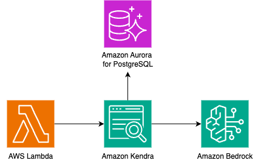

# AWS Lambda to Amazon Kendra to Amazon Bedrock with Aurora PostgreSQL

This pattern contains a sample AWS SAM stack that utilizes an AWS Lambda function to retrieve documents from an Amazon Kendra index (with Aurora PostgreSQL as the data source) and then pass it to Amazon Bedrock to generate a response. The pattern includes usage of the Amazon WorkDocs data source connector. 

Important: this application uses various AWS services and there are costs associated with these services after the Free Tier usage - please see the AWS Pricing page for details. You are responsible for any AWS costs incurred. No warranty is implied in this example.

## Requirements
* [Create an AWS account](https://portal.aws.amazon.com/gp/aws/developer/registration/index.html) if you do not already have one and log in. The IAM user that you use must have sufficient permissions to make necessary AWS service calls and manage AWS resources.
* [AWS CLI](https://docs.aws.amazon.com/cli/latest/userguide/install-cliv2.html) installed and configured
* [Git Installed](https://git-scm.com/book/en/v2/Getting-Started-Installing-Git)
* [AWS Serverless Application Model](https://docs.aws.amazon.com/serverless-application-model/latest/developerguide/serverless-sam-cli-install.html) (AWS SAM) installed
* [Request Amazon Bedrock Model Access for Anthropic Claude models on Amazon Bedrock](https://docs.aws.amazon.com/bedrock/latest/userguide/model-access.html)
* [Create and configure a VPC](https://docs.aws.amazon.com/vpc/latest/userguide/create-vpc.html) with at least two private subnets.
* Before deploying the solution, you need to set up an [Amazon Aurora PostgreSQL DB](https://docs.aws.amazon.com/AmazonRDS/latest/AuroraUserGuide/Aurora.CreateInstance.html) if you don't already have one.  During the database setup:
    1. Note the username and password, then [Store them in AWS Secrets Manager](https://docs.aws.amazon.com/secretsmanager/latest/userguide/create_secret.html) for later use.
    2. Choose the VPC you created earlier and select the private subnets.
    3. [Create a new security group](https://docs.aws.amazon.com/vpc/latest/userguide/creating-security-groups.html) (e.g., Kendra-sg) for the database.

To establish a private connection to the database:
- Create another new security group (e.g., rds-sg).
- Set its outbound rule to allow traffic to the security group created during database setup (Kendra-sg).
- Update the new security group's (rds-sg) inbound rule to allow traffic from the old security group (Kendra-sg).

Next, create two VPC endpoints:
- One for Secrets Manager
- One for Kendra

Associate both endpoints with:
- The VPC you created
- The private subnets
- The security group (Kendra-sg)

Once your database is ready, upload the documents you want to index. Ensure your Aurora PostgreSQL DB is in the same AWS region where you plan to deploy the Kendra index. Verify that all tables/databases are successfully uploaded and accessible before proceeding with the deployment.


## Deployment Instructions
1. Create a new directory, navigate to that directory in a terminal and clone the GitHub repository:
    ```
    git clone https://github.com/aws-samples/sample-genai-connector-patterns.git
    ```
1. Change directory to the pattern directory:
    ```
    cd kendra-bedrock-aurora-postgresql-sam
    ```
1. From the command line, use AWS SAM to deploy the AWS resources for the pattern as specified in the template.yml file:
    ```
    sam deploy --guided --capabilities CAPABILITY_NAMED_IAM
    ```
1. During the prompts:

    * Enter a SAM stack name
    * Enter the desired AWS Region
    * Enter one of the supported model IDs for Anthropic Claude on Bedrock from: `'anthropic.claude-instant-v1'`, `'anthropic.claude-3-sonnet-20240229-v1:0'`, `'anthropic.claude-3-haiku-20240307-v1:0'`, `'anthropic.claude-v2'`
    * Enter your Aurora PostgreSQL cluster endpoint
    * Enter database name and table name
    * Enter the AWS Secrets Manager ARN containing database credentials
    * Enter VPC ID where Aurora is deployed
    * Enter private subnet IDs (comma-separated)
    * Enter database security group IDs (comma-seperated)
    * Enter table unique ID column name
    * Enter table data column name
    * Enter change detecting columns (comma-separated, 1-5 columns)
    * Choose Kendra edition (DEVELOPER_EDITION or ENTERPRISE_EDITION)
    * Allow SAM CLI to create IAM roles with the required permissions

    Once you have run `sam deploy --guided --capabilities CAPABILITY_NAMED_IAM` mode once and saved arguments to a configuration file (samconfig.toml), you can use `sam deploy` in future to use these defaults.*

1. Note the outputs from the SAM deployment process. These contain the resource names and/or ARNs which are used for testing.

# How it works
Please refer to the architecture diagram below:



Here's a breakdown of the steps:

**AWS Lambda:** Two AWS Lambda functions are created. `DataSourceSync` crawls and indexes the content. `InvokeBedrockLambda` invokes the specified model by passing the retrieved content from Amazon Kendra as context to the generative AI model.

**Amazon Kendra:** An Amazon Kendra index is created with an Aurora PostgreSQL data source connector. When a the `InvokeBedrockLambda` function is called, records are retrieved from the Amazon Kendra index. The Kendra index created is an example and customers should update the configurations to match their data security practices. 

**Amazon Bedrock:** Records retrieved from the Amazon Kendra index are sent to Amazon Bedrock which responds with a generated response.

## Testing

CLI Lambda invoke with test event:

```bash
aws lambda invoke --function-name <<INVOKE_BEDROCK_LAMBDA_FUNCTION_ARN>> --cli-binary-format raw-in-base64-out --payload '{"question": "Value" }' output.txt
```

The output.txt will contain the response generated by Amazon Bedrock.

Example JSON Lambda test event:

```
{
    "question": "Value"
}
```

## Cleanup

1. Delete the stack
    ```bash
    sam delete
    ```
----
<!-- Copyright Amazon.com, Inc. or its affiliates. All Rights Reserved.

SPDX-License-Identifier: MIT-0 -->