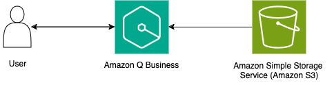
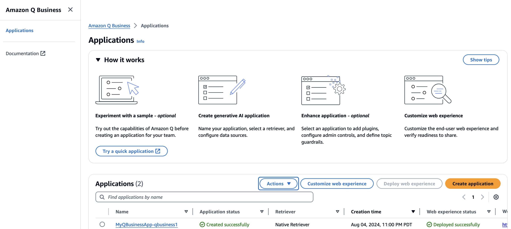
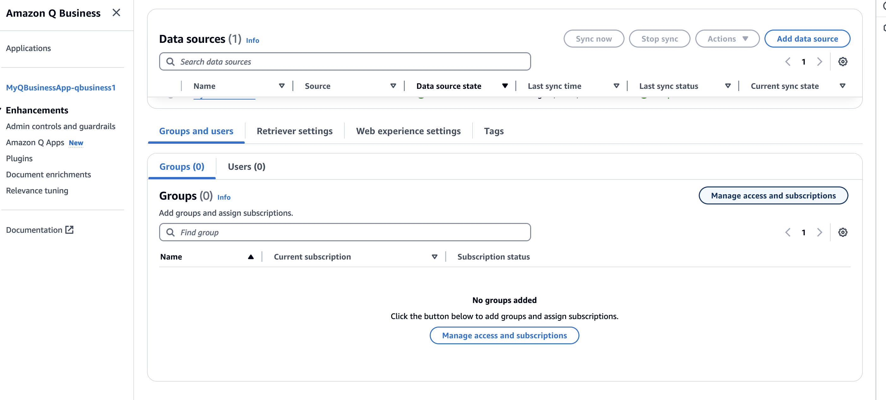
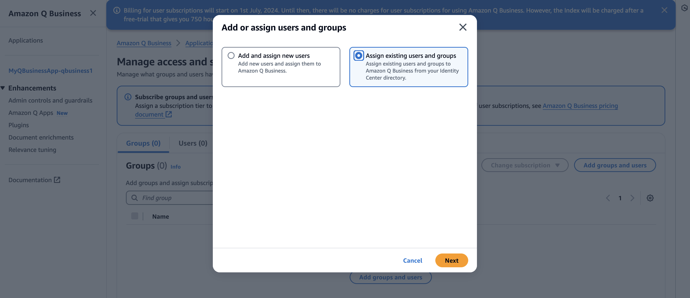
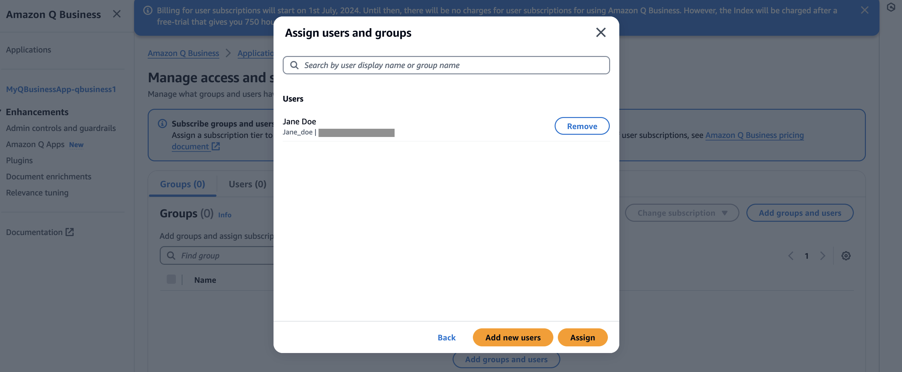
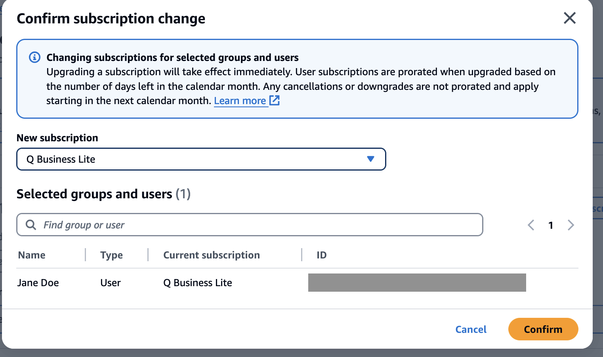
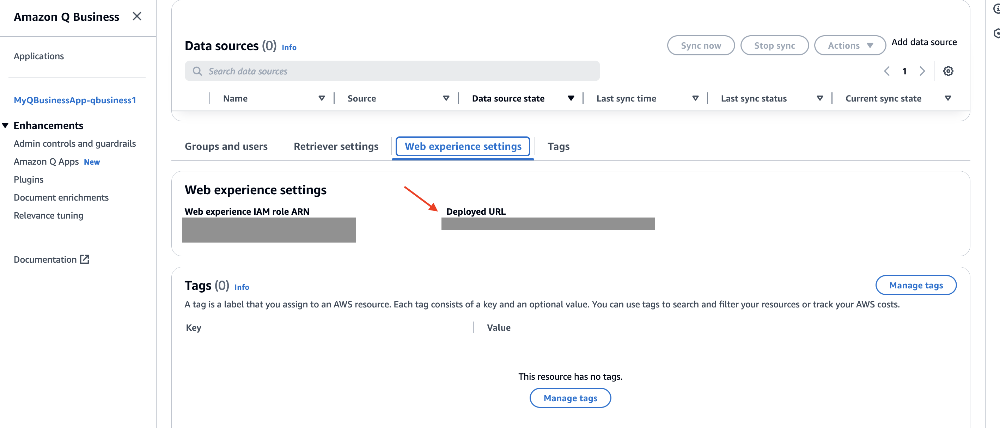
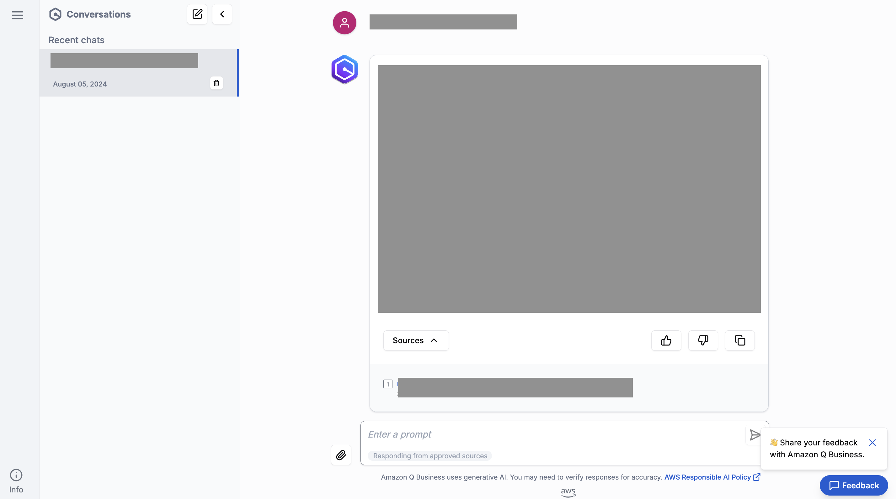

# Amazon Q Business to Amazon Simple Storage Service (Amazon S3)

This pattern contains a sample AWS SAM stack that leverages Amazon Q Business to build a generative AI application to derive insights from content present in a Gmail Account. An AWS Lambda function initiates the crawling and indexing of the documents present in the specified Gmail Account. Users can then ask questions to the Amazon Q Business application to receive a generated response. 

Important: this application uses various AWS services and there are costs associated with these services after the Free Tier usage - please see the AWS Pricing page for details. You are responsible for any AWS costs incurred. No warranty is implied in this example.

## Requirements
* [Create an AWS account](https://portal.aws.amazon.com/gp/aws/developer/registration/index.html) if you do not already have one and log in. The IAM user that you use must have sufficient permissions to make necessary AWS service calls and manage AWS resources.
* In Gmail, make sure you:
  * Are using Google Workspace.
  * Have created a Google Cloud Platform admin account and a [Google Cloud project](https://developers.google.com/workspace/guides/create-project).
  * Activated the Gmail API and Admin SDK API in your admin account.
  * Created a service account and downloaded a JSON private key for your Gmail. For information about how to create and access your private key, see [Create a service account key](https://cloud.google.com/iam/docs/keys-create-delete) and [Service account credentials](https://cloud.google.com/iam/docs/service-accounts) on the Google Cloud website.
  * Copied your admin account email, your service account email, and your private key to use for authentication.
  * Added the following Oauth scopes (using an admin role) for your user and the shared directories you want to index:
    * https://www.googleapis.com/auth/admin.directory.user.readonly
    * https://www.googleapis.com/auth/gmail.readonly
* [AWS CLI](https://docs.aws.amazon.com/cli/latest/userguide/install-cliv2.html) installed and configured
* [Git Installed](https://git-scm.com/book/en/v2/Getting-Started-Installing-Git)
* [AWS Serverless Application Model](https://docs.aws.amazon.com/serverless-application-model/latest/developerguide/serverless-sam-cli-install.html) (AWS SAM) installed
* [Enable AWS IAM Identity Center](https://docs.aws.amazon.com/singlesignon/latest/userguide/get-set-up-for-idc.html)
* [Create Users in AWS IAM Identity Center](https://docs.aws.amazon.com/singlesignon/latest/userguide/addusers.html). Note down the Instance ARN by going to the AWS IAM Identity Center console --> Settings --> Instance ARN. You will require it when deploying the stack.
* [Create a Secret in AWS Secrets Manager](https://docs.aws.amazon.com/secretsmanager/latest/userguide/create_secret.html). Make sure to select "Other type of secret" and enter the required keys, with their corresponding values from your Gmail service account credentials.


## Deployment Instructions
1. Create a new directory, navigate to that directory in a terminal and clone the GitHub repository:
    ```
    git clone https://github.com/aws-samples/serverless-patterns
    ```
1. Change directory to the pattern directory:
    ```
    cd qbusiness-gmail-lambda
    ```
1. From the command line, use AWS SAM to deploy the AWS resources for the pattern as specified in the template.yml file:
    ```
    sam deploy --guided --capabilities CAPABILITY_NAMED_IAM
    ```
1. During the prompts:
    * Enter a stack name.
    * Enter the desired AWS Region.
    * Enter the AWS IAM Identity Center Instance ARN noted from the instructions followed in Requirements.
    * Enter the AWS Secrets Manager ARN noted from the instructions followed in Requirements.
    * Allow SAM CLI to create IAM roles with the required permissions.
    Once you have run `sam deploy --guided` mode once and saved arguments to a configuration file (samconfig.toml), you can use `sam deploy` in future to use these defaults.*
1. Note the outputs from the SAM deployment process. These contain the resource names and/or ARNs which are used for testing.

# How it works
Please refer to the architecture diagram below:



Here's a breakdown of the steps:

**Amazon Q Business Application:** Amazon Q Business application created with Gmail as the data source.

**Gmail:** The Gmail repository that contains emails and attachments to be indexed.

**AWS Lambda:**  AWS Lambda function `DataSourceSync` crawls and indexes the content from the Gmail repository. The Amazon Q Business application retrieves data from the indexed content and provides a generated response.

## Testing
1. Go to the Amazon Q Business Console and verify that your application `MyQBusinessApp-${StackName}` has been created.
    

1. Click on the Name of the Application. Scroll down to the `Groups and Users` section. Click on `Manage access and Subscriptions`.
    

1. Click on `Add groups and users` and select `Assign existing users and groups`. Click `Next`. 
    Note: If you have NOT already created a user in the Requirements section, then create one by choosing `Add and assign new users` instead and add the user. 
    

1. Add the name of the user and click on `Assign`.
    

1. Select the user and with the `Edit subscription` button, select `Update subscription tier`. In the `New subscription` dropdown, choose `Q Business Lite` and `Confirm`.
    

1. Go back to your application. Under `Web experience settings`, copy the `Deployed URL` link.
    

1. Open the URL in a New Incognito Window. Login to the web experience with the credentials of the created user. Ask a question in the chat interface regarding the emails and attachments in the Gmail account you have provided as a data source.
    

## Cleanup
1. Delete the stack
    ```bash
    sam delete
    ```
----
Copyright 2023 Amazon.com, Inc. or its affiliates. All Rights Reserved.
SPDX-License-Identifier: MIT-0
